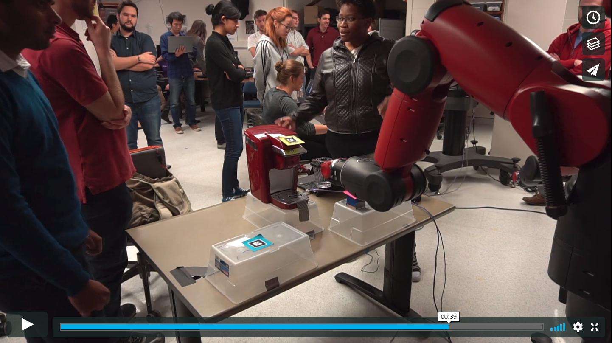

# Readme
##Starbax

##### Functionality of package
This package is a collection of scripts and message definitions created to have a Baxter robot prepare a cup of coffee using a single serve coffee maker, one cup, and one single serve packet of coffee. The objects must be set at a specific height and the coffee maker must face Baxter, but objects can otherwise be placed arbitrarily so long as Baxter can easily reach them.

This package also makes use of the CVBridge to convert between ROS images and CV images when performing color segmentation.

Additonally, the package uses Baxter's in-built inverse kinematics service to move to desired locations. The objective is to approach the objects horizontally and while keeping level, place them at the desired position.
 
In total, there are three main components of this project: Color Segmentation, AR tag Recognition, and Inverse Kinematics to move Baxter's end effector. 

One launch file is included named ["baxter_sw.launch"][launch-launch1]. This should start everything. There have been some instances of the [pose-and-item](/src/pose_and_item) node crashing after startup. The suggested work-around for this is to either restart that node individually, or to operate the nodes manually.

##### [Scripts][src]
* The [pic_cal_sw.py](src/pic_cal_sw.py) script launches the node `pic_cal` that subscribes to Baxter's left hand camera topic -`/cameras/left_hand_camera/image`. While not actually run in the launch file, this node was used to obtain clear images of the [blue][media-post2], [yellow][media-post1], and [pink][media-post3] post-it-notes that Baxter used to differentiate between the three different objects: the Keurig, cup, and K-cup.

* The [table_cam_sw.py](src/table_cam_sw.py) script launches the node `table_cam` that subscribes to Baxter's left hand camera topic - `/cameras/left_hand_camera/image`. It then loads the three post-it-note images from the media folder and uses histogram-based color segmentation to create three masks - one for each color. Assuming the camera has a clear view of all three post-it-notes, it finds the centroids and compares them to find their relative positions. It then publishes a String message on the `pos_items` topic listing the objects from left to right as one faces Baxter. 

* The [starbax_sw.py](/src/starbax_sw.py) script launches the node `initial` that positions Baxter's left arm so that it's camera has a top-down view of the table where the Keurig, cup, and K-cup are located.

* The [artransforms.py][src-artrans] script will sunscribe to the ar_pose_marker topic that was generated by the Avlar Marker package. This scrip will then extract the id, the x,y,z , and orientation data of each of the tags and republishes them on the topic ar_pose_id as a custom message type called ar_tag. 

* The [pose_and_item.py](/src/pose_and_item) script launches the node `pose_item` that subscribes to the `pos_items` and `ar_pose_id` topics to get the relative positions of the objects and their pose in the world. The incoming pose is of the `ar_tag` message defintin. It then sorts the three poses from least to greatest using their 'y' coordinates. The pose with the smallest 'y' coordinate is then paired with the left most object as one faces Baxter, and so forth. Finally, the node publishes a new message (`ar_tagstr`) contatining the object name and the pose.

* The [movement.py][src-movem] script launches 
Breaking the process of picking and place an obect into several small independent tasks, this node defines each of these tasks as a seperate function. The main function calls all of these in the correct order while taking the poses of the objects from the pose_and_item.py node. This information is recieved by the subscribing to the topic "pose_and_item".
The node also calls services to open and close the Keurig lid.

* The [open_service.py][src-open] script launches the `opener_node` node, which provides the `/opener` service. This service is intended to be called with a Pose message containing the position of the coffee maker relative to the base frame of Baxter. When called, the node will use the [ExternalTools/left/PositionKinematicsNode/IKService][src-open-ik] to produce a series of joint angle solutions relative to the coffee maker, then command the left arm and gripper in a sequence intended to open the lid of the coffee maker.

* The [close_service.py][src-close] script launches the `close_node` node, which provides the `/closer` service. This service is intended to be called with a Pose message containing the position of the coffee maker relative to the base frame of Baxter. When called, the node will use the [ExternalTools/left/PositionKinematicsNode/IKService][src-close-ik] to produce a series of joint angle solutions relative to the coffee maker, then command the left arm and gripper in a sequence intended to close the lid of the coffee maker.

* The [press_service.py][src-press] script launches the `presser_node` node, which provides the `/presser` service. This service is intended to be called with a Pose message containing the position of the coffee maker relative to the base frame of Baxter. When called, the node will use the [ExternalTools/left/PositionKinematicsNode/IKService][src-press-ik] to produce a series of joint angle solutions relative to the coffee maker, then command the left arm and gripper in a sequence intended to press the start button on the coffee maker.

##### Topics & Services
* `/opener` : This service can be called with a Pose message that contains the position of the coffee maker. It will plan and execute a series of joint movements intended to open the lid of the coffee maker using simple IK solving when it is called. After finishing it will return `True`. It uses the [Open2.srv][srv-2] definition.

* `/closer` : This service can be called with a Pose message that contains the position of the coffee maker. It will plan and execute a series of joint movements intended to close the lid of the coffee maker using simple IK solving when it is called. After finishing it will return `True`. It uses the [Open2.srv][srv-2] definition.

* `/presser` : This service can be called with a Pose message that contains the position of the coffee maker. It will plan and execute a series of joint movements intended to press the start button of the coffee maker using simple IK solving when it is called. After finishing it will return `True`. It uses the [Open2.srv][srv-2] definition.

##### Parameters
* Parameter general notes
* /parameter_name description

##### [Launch Files][launch]

* [baxter_sw.launch][launch-launch1]: Describe me!

[src]:https://github.com/Laurenhut/ME495-final-project/tree/master/src
[src-artrans]:https://github.com/Laurenhut/ME495-final-project/blob/master/src/artransforms.py
[src-movem]:https://github.com/Laurenhut/ME495-final-project/blob/master/src/movement.py
[src-close]:https://github.com/Laurenhut/ME495-final-project/blob/master/src/close_service.py
[src-close-ik]:https://github.com/Laurenhut/ME495-final-project/blob/8abeed0ab9085f8ded1aa93a2818832768050d51/src/close_service.py#L90
[src-open]:https://github.com/Laurenhut/ME495-final-project/blob/master/src/open_service.py
[src-open-ik]:https://github.com/Laurenhut/ME495-final-project/blob/8abeed0ab9085f8ded1aa93a2818832768050d51/src/open_service.py#L90
[src-press]:https://github.com/Laurenhut/ME495-final-project/blob/master/src/press_service.py
[src-press-ik]:https://github.com/Laurenhut/ME495-final-project/blob/8abeed0ab9085f8ded1aa93a2818832768050d51/src/press_service.py#L90

[srv-2]:https://github.com/Laurenhut/ME495-final-project/blob/master/srv/Open2.srv

[launch]:https://github.com/Laurenhut/ME495-final-project/tree/master/launch
[launch-launch1]:https://github.com/Laurenhut/ME495-final-project/blob/master/launch/baxter_sw.launch

[media-post1]:https://github.com/Laurenhut/ME495-final-project/blob/master/media/coffee.png
[media-post2]:https://github.com/Laurenhut/ME495-final-project/blob/master/media/cup.png
[media-post3]:https://github.com/Laurenhut/ME495-final-project/blob/master/media/kcup.png

